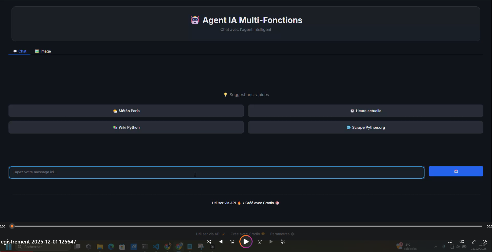

# LangGraph & LangChain – AI Multi-Tools Agent

Ce projet implémente un **agent IA multi-tools** construit avec **LangGraph** et **LangChain (GPT-4o)**.  
Il choisit automatiquement le bon outil pour répondre aux questions (web, Wikipedia, résumé, météo, heure, vision, audio) et est exposé via une **interface Gradio** moderne.

---

## 🎥 Démo

### 🖼 Aperçu de l’interface



> Capture d’écran de l’onglet Chat (style Grok / Streamlit) et de l’onglet Analyse d’image.

### 🎬 Vidéo de démonstration (stockée dans le repo)

<video controls width="100%" src="https://vimeo.com/1142186456">
  Votre navigateur ne supporte pas la lecture vidéo intégrée.
</video>


---

## 🧩 Capacités de l’agent

Ce projet implémente un **agent IA multi-tools** construit avec **LangGraph** et **LangChain (GPT-4o)**, capable de :

- 🔎 **Scraper des pages web**  
  Extraire le contenu d’une URL et le réutiliser (résumé, analyse, etc.).

- 📚 **Chercher sur Wikipedia**  
  Récupérer des résumés en français sur des sujets variés.

- 🌐 **Faire des recherches web**  
  Interroger le web via DuckDuckGo HTML pour des résultats rapides.

- 📝 **Résumer du texte**  
  Produire des résumés clairs et concis à partir de textes longs.

- 🌤️🕒 **Donner la météo et l’heure**  
  Obtenir la météo actuelle d’une ville et l’heure dans un fuseau horaire donné.

- 🖼 **Analyser des images (Vision)**  
  Utiliser GPT-4o Vision pour décrire, analyser et extraire des informations à partir d’images.

- 🔊 **Générer de l’audio (TTS)**  
  Transformer les réponses texte en audio avec gTTS pour les écouter.

---

## 📦 Installation

On recommande un environnement virtuel :

```bash
python -m venv .venv
source .venv/bin/activate      # sous Windows : .venv\Scripts\activate
